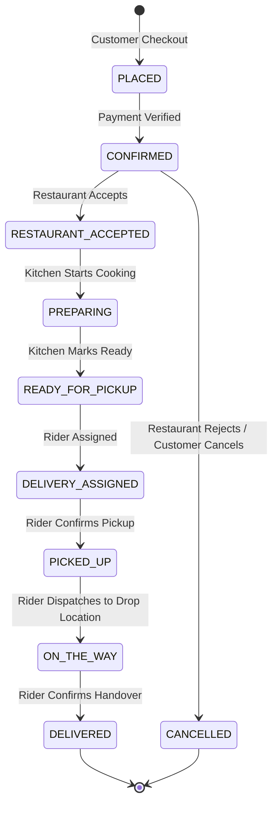

# Zestora Architecture & System Design Documentation

This document describes the architectural foundation, data flow, order lifecycle state machine, and service layer design of the **Zestora Food Delivery & Quick-Commerce Platform**.

---

## 1. System Overview

Zestora is built as a unified Next.js 14+ full-stack application using the App Router, TypeScript, Tailwind CSS, and a dual-layer data architecture (in-memory reactive singleton store for instant zero-dependency demonstration & evaluation + PostgreSQL Prisma ORM for production scale).

### Multi-Actor Ecosystem

Zestora orchestrates four distinct personas within one cohesive codebase:

1. **Customer Portal (`/`, `/restaurants`, `/grocery`, `/checkout`, `/orders`, `/profile`, `/support`)**:
   - Food and grocery item browsing with dietary filters (Veg / Non-Veg / Halal / Spice level).
   - Authoritative cart calculator with real-time dynamic pricing breakdown (subtotal, delivery, taxes, packaging, tips, coupons).
   - Food customization engine (variants, multi-select add-ons, cooking instructions).
   - Real-time animated order tracker with simulated GPS driver movement and instant tax invoice generation.

2. **Restaurant Partner Kitchen Hub (`/restaurant-dashboard`)**:
   - Live incoming order stream with audio/visual alerts.
   - Granular order management: Accept, Reject (with reason code), Mark Preparing, Mark Ready for Pickup.
   - Menu catalog management (stock availability toggle, price edits, prep time).
   - Financial ledger: Gross merchandise value, platform commission breakdown (20%), net payout calculations.

3. **Delivery Partner Driver App (`/delivery-dashboard`)**:
   - Availability toggle (Online / Offline duty switch).
   - Incoming delivery dispatch with pickup location, drop location, distance in km, and earnings preview.
   - Step-by-step delivery execution: Arrived at restaurant &rarr; Confirm order pickup &rarr; Delivered to customer.
   - Driver earnings history (base fee + distance incentive + peak bonus + 100% customer tips).

4. **Platform Admin Command Center (`/admin`)**:
   - Executive telemetry: Total GMV, platform commission, active drivers, active restaurants, active orders.
   - Dynamic coupon engine: Create and configure flat/percentage discount codes with caps and minimum order restrictions.
   - Delivery zone and surge configuration.
   - Comprehensive audit log tracking every critical mutation across all 4 actors.

---

## 2. Order Lifecycle State Machine

Orders follow a strict finite state machine enforced on both the server (`server/dataStore.ts`) and API routes (`/api/v1/orders/[id]`):



### Transition Validation Rules

- Orders cannot skip intermediate stages (e.g., `PLACED` cannot jump directly to `DELIVERED`).
- Cancellation is permitted during `PLACED` and `CONFIRMED`.
- Once `PREPARING`, cancellations incur kitchen compensation policies.
- Every state transition records an entry in the order's `statusHistory` array with actor attribution, timestamp, and notes.

---

## 3. Authoritative Pricing Engine

Zestora strictly adheres to server-side pricing calculation. The client cannot forge or manipulate total amounts:

$$\text{Total Payable} = \text{Item Subtotal} + \text{Packaging Fee} + \text{Delivery Fee} + \text{Platform Fee} + \text{Taxes (5\% GST)} + \text{Rider Tip} - \text{Coupon Discount}$$

### Pricing Rules

1. **Delivery Fee**:
   - ₹40 standard delivery fee within 5 km.
   - **Free Delivery threshold**: ₹0 delivery fee when order subtotal is $\ge \text{₹}499$.
2. **Platform Fee**: Flat ₹5 per order.
3. **Packaging Fee**: Flat ₹15 for food orders (waived for grocery orders).
4. **Taxes**: 5% GST on food subtotal + packaging.
5. **Coupons**: Validated server-side against minimum order value, validity dates, and maximum discount caps (`ZEST50`: 50% off up to ₹100, min ₹299).

---

## 4. Dual Data Persistence Layer

```
┌────────────────────────────────────────────────────────┐
│                   Next.js API Layer                    │
│            (/api/v1/orders, /restaurants, etc.)        │
└──────────────────────────┬─────────────────────────────┘
                           │
             ┌─────────────┴─────────────┐
             ▼                           ▼
┌─────────────────────────┐ ┌────────────────────────────┐
│   Demo Reactive Store   │ │     Production Prisma      │
│  (server/dataStore.ts)  │ │      (PostgreSQL ORM)      │
│  • In-memory singleton  │ │  • 35+ relational models   │
│  • Instant evaluation   │ │  • Transactions & Indexes  │
│  • Zero setup needed    │ │  • Production deployment   │
└─────────────────────────┘ └────────────────────────────┘
```

---

## 5. Security & RBAC Model

Zestora implements Role-Based Access Control (RBAC):
- `CUSTOMER`: Browse, place orders, rate orders, create support tickets.
- `RESTAURANT_OWNER` / `RESTAURANT_MANAGER`: Manage kitchen queue, toggle item availability, review restaurant metrics.
- `DELIVERY_PARTNER`: Accept deliveries, update pickup & drop statuses, view driver earnings.
- `ADMIN` / `SUPER_ADMIN`: Access all platform metrics, audit logs, zone configurations, and coupon management.
