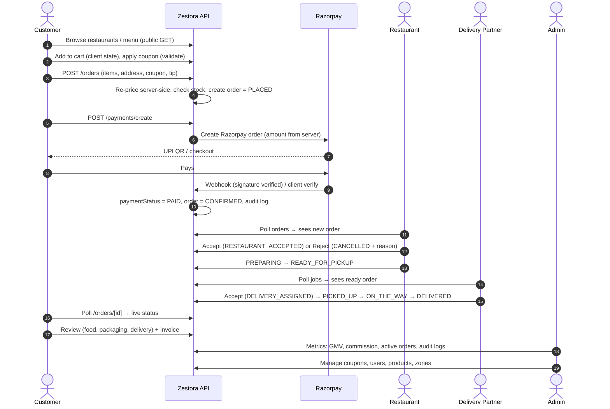
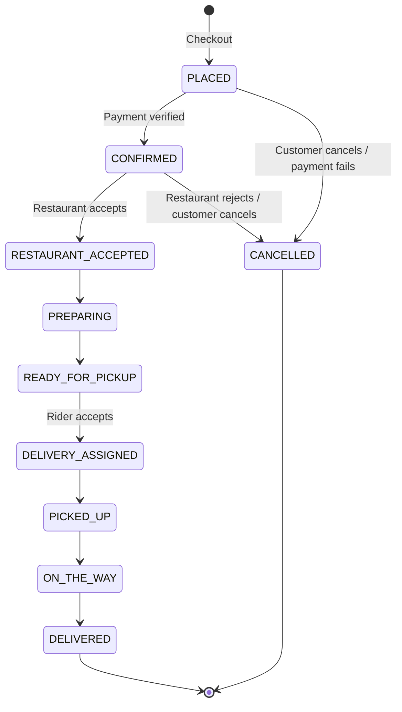
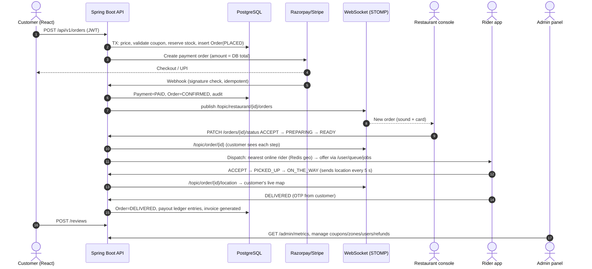

# Zestora — Architecture & Workflows

This document has two parts:

- **Part A — Current architecture** (what exists in the repo today: Next.js prototype).
- **Part B — Target architecture** (the planned production stack: React + Java Spring Boot, etc.).

Status of implementation is tracked in `PROGRESS.md`; the product idea is in `IDEA.md`.

---

# PART A — CURRENT ARCHITECTURE (Next.js prototype)

## 1. Overview

```
                        ┌────────────────────────────────────────────┐
                        │              Browser (4 actors)            │
                        │ Customer · Restaurant · Rider · Admin      │
                        └──────────────────┬─────────────────────────┘
                                           │ HTTP (cookies), polling 3–4 s
                        ┌──────────────────▼─────────────────────────┐
                        │            Next.js 14 (App Router)         │
                        │  middleware.ts  → page/API route guards    │
                        │  app/**/page.tsx → UI (React, Tailwind)    │
                        │  app/api/**     → REST route handlers      │
                        └──────────────────┬─────────────────────────┘
                                           │
                 ┌─────────────────────────┼───────────────────────────┐
                 ▼                         ▼                           ▼
        server/auth.ts          server/dataStore.ts          server/services/
        (cookie → user,         (in-memory singleton:        razorpayService.ts
         requireAdmin, IDOR)     orders, users, menu,        (create order, HMAC
                                 coupons, riders, audit)      verify, webhook)
                                           │
                                           ▼   (not connected yet)
                                prisma/schema.prisma → PostgreSQL
```

### Repository layout
```
app/                  pages + API routes
  page.tsx, restaurants/, grocery/, checkout/, orders/, my-orders/, favorites/, offers/, support/, profile/
  login/, signup/
  restaurant-dashboard/   delivery-dashboard/   admin/
  api/auth/*  api/orders  api/products  api/admin/*  api/payments/*
  api/v1/{restaurants,products,orders,coupons,delivery,reviews,support,admin/metrics}
components/           Navbar, CartDrawer, FoodCustomizationModal, LocationModal, Footer, AdminProtectedRoute
lib/                  cartContext.tsx (cart + pricing + auth state), utils.ts
server/               auth.ts, dataStore.ts, passwordUtils.ts, seedData.ts, services/razorpayService.ts
prisma/schema.prisma  production schema (not wired up)
types/index.ts        shared TypeScript models
middleware.ts         route protection
tests/run-tests.js    test script
```

## 2. Actors and roles

| Actor | Role value | Entry point | Main capabilities |
|---|---|---|---|
| Guest | none | `/`, `/restaurants`, `/grocery`, `/offers` | Browse only |
| Customer | `CUSTOMER` | `/checkout`, `/my-orders`, `/orders/[id]`, `/profile`, `/favorites`, `/support` | Order, pay, track, review |
| Restaurant partner | `RESTAURANT_OWNER` / `RESTAURANT_MANAGER` | `/restaurant-dashboard` | Accept/reject, prepare, menu, settlement |
| Delivery partner | `DELIVERY_PARTNER` | `/delivery-dashboard` | Go online, pick up, deliver, earnings |
| Admin | `ADMIN` / `SUPER_ADMIN` | `/admin` | Metrics, users, products, coupons, audit |
| Support agent / grocery manager | `SUPPORT_AGENT`, `GROCERY_MANAGER` | — | Defined in schema, no UI yet |

## 3. End-to-end workflow: User → Restaurant → Rider → Admin



### Step-by-step by actor

**Customer**
1. Sign up / log in → server sets cookies.
2. Picks delivery area (`LocationModal`), browses restaurants or QuickMart grocery.
3. Opens an item → `FoodCustomizationModal` (variant, add-ons, notes) → cart (`cartContext`).
4. Checkout: address, coupon, tip, payment method. Client shows an estimate; **the server recomputes** the real total.
5. Pays (UPI/Razorpay; demo can simulate). Order becomes `CONFIRMED`.
6. Tracks `/orders/[id]`; after delivery rates the order and can print the invoice.
7. Can open a support ticket linked to an order.

**Restaurant partner**
1. Logs in, opens the kitchen hub; new `CONFIRMED` orders appear (polling).
2. Accepts (`RESTAURANT_ACCEPTED`) or rejects with a reason code (`CANCELLED`).
3. Taps Preparing → Ready for pickup.
4. Toggles items out of stock, edits price/prep time, opens/closes the restaurant.
5. Reviews settlement: gross sales, 20% platform commission, net payout.

**Delivery partner**
1. Logs in, switches Online.
2. Sees ready orders with pickup/drop, distance and earning preview; accepts one.
3. Marks Picked up → On the way → Delivered.
4. Earnings = base + distance incentive + peak bonus + 100% tip.

**Admin**
1. Logs in (redirected to `/admin`).
2. Watches GMV, commission, active orders/drivers/restaurants.
3. Creates coupons, manages products/users, reviews audit logs and support tickets.

## 4. Order lifecycle (state machine)



Rules: no skipping stages; every transition is appended to `statusHistory` with actor, time and note;
cancellation after `PREPARING` carries a kitchen-compensation policy.

**Who may trigger which transition (target rule — partly NOT enforced today, see PROGRESS.md §4):**

| Transition | Allowed actor |
|---|---|
| PLACED→CONFIRMED | System (payment webhook) |
| CONFIRMED→RESTAURANT_ACCEPTED / CANCELLED(reject) | Restaurant of that order |
| RESTAURANT_ACCEPTED→PREPARING→READY_FOR_PICKUP | Restaurant of that order |
| READY_FOR_PICKUP→DELIVERY_ASSIGNED→…→DELIVERED | The assigned rider |
| PLACED/CONFIRMED→CANCELLED(customer) | Order's customer |
| Any→CANCELLED (override), refunds | Admin |

## 5. Pricing engine (server-authoritative)

```
Total = Subtotal + Packaging(₹15 food / ₹0 grocery) + Delivery(₹40, free if subtotal ≥ ₹499)
        + Platform fee(₹5) + GST(5% of subtotal + packaging) + Tip − Coupon discount
```
Coupons are validated on the server (min order, validity, max cap). Examples: `ZEST50` (50% up to ₹100, min ₹299),
`FREEDEL` (free delivery, min ₹199), `WELCOME100` (₹100 off, min ₹399).
The payment amount is read from the stored order, never from the client.

## 6. Authentication & authorization (current)

| Piece | Current behaviour | Problem |
|---|---|---|
| Login | `POST /api/auth/login` checks `hashed:<plaintext>` | Not hashed |
| Session | cookies `zestora_token` (= user id) and `zestora_role`, `httpOnly:false` | Forgeable |
| Page guard | `middleware.ts` reads cookies; guards `/admin`, customer pages, auth pages | Trusts cookie role; restaurant/delivery pages unguarded |
| API guard | `requireAuth`, `requireAdmin`, `requireCustomerOrAdmin` in `server/auth.ts` | Not applied to every route |
| IDOR | Customers filtered to own orders when logged in | Guests see all orders on list endpoint |

Target fix is Part B §7.

## 7. Payments (current)

```
Customer ─▶ POST /api/payments/create ─▶ razorpayService.createOrder (amount from stored order)
        ◀─ razorpayOrderId, qrString, keyId
Customer pays ─▶ Razorpay ─▶ POST /api/payments/razorpay/webhook (HMAC verified)
Client also calls POST /api/payments/verify (HMAC of orderId|paymentId)
GET /api/payments/[orderId]/status  ← polled every 4 s by the payment page
POST /api/payments/simulate         ← demo only: marks order PAID  (must be disabled in production)
```

## 8. Data model (Prisma schema, not yet connected)

Domains: IAM (User, Account, Session) · Restaurants & menus · Grocery & inventory/stock reservation ·
Orders (Order, OrderItem, OrderStatusHistory, CancellationDetail) · Logistics (DeliveryPartner, Vehicle,
DeliveryAssignment, RiderLocationLog) · Promotions (Coupon, CouponUsage, OfferBanner, SurgeConfig) ·
Reviews & support · Audit (AuditLog, TaxInvoice). See `DATABASE.md`.

## 9. Known limitations of Part A
In-memory persistence, polling instead of push, simulated tracking, weak auth, unconnected DB, tests that don't
import real code. Full list in `PROGRESS.md` §4.

---

# PART B — TARGET ARCHITECTURE (production stack)

**Stack:** React (TypeScript) · Java + Spring Boot · PostgreSQL (or MySQL) · Spring Data JPA/Hibernate · REST ·
Spring Security + JWT · WebSocket · Razorpay/Stripe · Google Maps/Mapbox · Cloudinary/S3 · Maven ·
JUnit + Mockito + React Testing Library.

## 1. System context

```
 ┌──────────────┐  ┌───────────────────┐  ┌──────────────────┐  ┌────────────┐
 │ Customer web │  │ Restaurant console │  │ Rider web/PWA    │  │ Admin panel│   React SPAs
 └──────┬───────┘  └─────────┬─────────┘  └────────┬─────────┘  └─────┬──────┘   (one codebase, role-based routes)
        │ HTTPS REST + JWT      │ WebSocket (STOMP)  │                  │
        └──────────────┬────────┴────────────────────┴──────────────────┘
                       ▼
              ┌───────────────────┐        ┌─────────────────────────────┐
              │  Nginx / Gateway  │───────▶│  Spring Boot application     │
              │  TLS, rate limit  │        │  (modular monolith)          │
              └───────────────────┘        └──────────────┬──────────────┘
                                                          │
        ┌───────────────┬──────────────┬─────────────┬────┴─────────┬──────────────┐
        ▼               ▼              ▼             ▼              ▼              ▼
   PostgreSQL        Redis         Razorpay/     Google Maps /   Cloudinary /   FCM / SMS /
   (JPA/Hibernate)  (cache, rider   Stripe        Mapbox          AWS S3        Email
                     locations,
                     rate limits)
```

Start as a **modular monolith** (one deployable, clear package boundaries) and split later only if needed.

## 2. Backend module structure (Maven)

```
zestora-backend/
├── pom.xml
└── src/main/java/com/zestora/
    ├── ZestoraApplication.java
    ├── config/        SecurityConfig, WebSocketConfig, CorsConfig, CloudinaryConfig, OpenApiConfig
    ├── common/        ApiResponse, exceptions, GlobalExceptionHandler, audit (AuditAspect), utils
    ├── auth/          AuthController, AuthService, JwtService, JwtAuthFilter, RefreshToken
    ├── user/          User, Role, Address, UserController
    ├── restaurant/    Restaurant, OperatingHour, BankDetail, RestaurantController (+ partner endpoints)
    ├── catalog/       MenuItem, Category, Variant, Addon, Inventory, StockReservation (restaurant + grocery)
    ├── cart/          pricing service (PricingEngine), CartController
    ├── order/         Order, OrderItem, OrderStatusHistory, OrderStateMachine, OrderController
    ├── payment/       PaymentService (Razorpay/Stripe strategy), WebhookController, Refund
    ├── delivery/      DeliveryPartner, Assignment, DispatchService, LocationController
    ├── promotion/     Coupon, CouponService, SurgeConfig, OfferBanner
    ├── review/        Review, ReviewReply
    ├── support/       SupportTicket, TicketMessage
    ├── notification/  NotificationService (FCM/SMS/Email), templates
    ├── media/         ImageUploadService (Cloudinary / S3)
    ├── realtime/      OrderEventPublisher, LocationBroadcaster (WebSocket)
    └── admin/         AdminController, MetricsService, ZoneService
```
Each module: `controller → service → repository (Spring Data JPA) → entity`, with DTOs at the API boundary
(never expose entities) and Bean Validation on every request DTO.

## 3. Frontend structure (React + TypeScript)

```
zestora-frontend/src/
├── app/            router, providers (Auth, Cart, Socket, Query)
├── features/       auth, catalog, cart, checkout, orders, tracking, restaurant, delivery, admin, support
├── components/     shared UI
├── api/            typed REST client (axios/fetch + interceptors for JWT refresh)
├── hooks/          useAuth, useOrderSocket, useGeolocation
└── tests/          React Testing Library + MSW
```
Route guards by role (`<RequireRole roles={['ADMIN']}>`). Server state via React Query; WebSocket updates
patch the query cache.

## 4. Workflow in the target system (User → Restaurant → Rider → Admin)



## 5. API surface (REST, versioned `/api/v1`)

| Group | Examples | Roles |
|---|---|---|
| Auth | `POST /auth/register, /auth/login, /auth/refresh, /auth/logout` | public |
| Catalog | `GET /restaurants, /restaurants/{id}/menu, /grocery/products` | public |
| Orders | `POST /orders`, `GET /orders/me`, `GET /orders/{id}`, `PATCH /orders/{id}/status` | CUSTOMER / RESTAURANT / RIDER / ADMIN (per rule) |
| Payments | `POST /payments/{orderId}`, `POST /payments/webhook` | CUSTOMER / provider |
| Restaurant | `GET /partner/orders`, `PUT /partner/menu/{id}`, `GET /partner/settlements` | RESTAURANT_* |
| Delivery | `PUT /rider/status`, `GET /rider/jobs`, `POST /rider/location` | DELIVERY_PARTNER |
| Admin | `/admin/metrics, /users, /coupons, /zones, /refunds, /audit-logs` | ADMIN |
| Support / Reviews | `POST /reviews`, `POST /support/tickets` | CUSTOMER, SUPPORT_AGENT |
| Media | `POST /media/sign` (signed upload) | authenticated |

Standard envelope `{success, data, error:{code,message}}`, pagination, OpenAPI docs via springdoc.

## 6. Order state machine (backend)

Implement as an explicit `OrderStateMachine` (enum transitions + allowed-actor map from Part A §4) invoked by
`OrderService`; illegal transition → `409 Conflict`; every change writes `OrderStatusHistory` + `AuditLog` and
publishes a WebSocket event. Use optimistic locking (`@Version`) on `Order` to stop two actors racing.

## 7. Security design

- **Passwords:** BCrypt (strength ≥ 10).
- **JWT:** short-lived access token (15 min) in memory; refresh token (7–30 days) in `httpOnly; Secure; SameSite` cookie, rotated and stored hashed; role claim signed (HS256/RS256).
- **Authorization:** `@PreAuthorize` on services/controllers + ownership checks (customer → own orders; restaurant → own restaurant; rider → assigned orders) to prevent IDOR.
- **Payments:** amount always from DB; verify HMAC; webhook idempotency key; never expose provider secrets; no "simulate" endpoint outside a `dev` profile.
- **Hardening:** CORS allow-list, rate limiting (login, OTP, coupon validate), security headers, input validation, SQL via JPA parameters, secrets from environment/secret manager, audit log of admin actions.
- **PII:** minimise stored data; encrypt bank details; mask phone numbers shown to riders.

## 8. Real-time design (WebSocket / STOMP)

| Topic / queue | Publisher | Subscriber |
|---|---|---|
| `/topic/restaurant/{id}/orders` | Order service | Restaurant console |
| `/user/queue/jobs` | Dispatch service | Rider |
| `/topic/order/{id}` | Order service | Customer, restaurant, rider |
| `/topic/order/{id}/location` | Rider location | Customer |
| `/topic/admin/live` | Metrics | Admin |

WebSocket handshake authenticated with the JWT; subscriptions authorised per topic. Fallback to polling if the socket drops.
Rider locations are kept in Redis (GEO) and sampled to `RiderLocationLog` for history.

## 9. Maps, media, notifications

- **Maps:** geocode/autocomplete on address entry, distance + ETA for delivery fee and rider job card, live map on tracking page (Google Maps JS or Mapbox GL).
- **Images:** client requests a signed upload from the backend, uploads straight to Cloudinary/S3, backend stores only the URL + public id; transform to WebP/thumbnails.
- **Notifications:** order events → `NotificationService` → FCM push, SMS (OTP/status), email (invoice).

## 10. Migration path from the prototype

1. Freeze the prototype API contract (`API.md`) as the spec.
2. Port `DATABASE.md`/`schema.prisma` to JPA entities + Flyway migrations (PostgreSQL).
3. Re-implement pricing, coupon and state-machine logic in Java with unit tests that reuse the numbers from `tests/run-tests.js`.
4. Build auth + RBAC first, then catalog → orders → payments → delivery → admin.
5. Port React pages from Next.js to a Vite/CRA React SPA (or keep Next.js as the front-end only and point it at Spring Boot).
6. Switch polling to WebSocket; add maps and media.
7. Remove the in-memory store and demo endpoints.

## 11. Testing strategy

| Layer | Tools | What |
|---|---|---|
| Unit | JUnit 5 + Mockito | PricingEngine, CouponService, OrderStateMachine, JwtService |
| Slice | `@WebMvcTest`, `@DataJpaTest` | Controllers + security rules, repositories |
| Integration | SpringBootTest + Testcontainers (PostgreSQL) | Order → payment → delivery happy path, concurrency on stock |
| Frontend | React Testing Library + MSW | Cart, checkout, role guards, order tracker |
| E2E (later) | Playwright | Customer → restaurant → rider → admin full journey |

## 12. Deployment

- Docker images for backend and frontend; `docker-compose` for local (app, PostgreSQL, Redis).
- Environments: `dev` (simulate payments allowed), `staging`, `prod`.
- Backend on a container host (Render/Railway/AWS ECS/EC2), PostgreSQL managed (RDS/Neon/Supabase, chosen later; local Docker PostgreSQL until then), static frontend on CDN (Vercel/Netlify/CloudFront).
- CI: Maven build + tests, frontend lint/test/build, Docker publish; CD to staging on merge, manual approval to prod.
- Observability: structured logs, Actuator health/metrics, error tracking (Sentry), uptime alerts, nightly DB backups.

## 13. Decisions (2026-10-07)
Java Spring Boot rebuild · PostgreSQL (local Docker for now, hosted later) · Razorpay · Cloudinary · food + grocery in v1 · **maps provider still open**
(Google Maps or Mapbox). See `PROGRESS.md` section 7.

## 14. As built (`backend/`)

The implemented backend is a modular monolith, one package per module under `com.zestora`:
`config` · `common` (ApiResponse, exceptions, audit) · `security` (JWT, filters, rate limit) · `user` · `auth` ·
`catalog` (restaurants, products with variants/add-ons, food **and** grocery) · `promotion` (coupons) ·
`order` (PricingEngine, OrderStateMachine, OrderAccess, OrderService, scheduler) · `payment` (gateway abstraction,
Razorpay + dev mock, webhook) · `delivery` · `realtime` (order events to STOMP) · `media` (Cloudinary signing) ·
`review` · `support` · `admin` · `seed` (dev-only demo data). The schema is owned by Flyway (`V1`, `V2`).

Differences from the plan above:
- Rider dispatch is automatic (least-busy online rider) rather than offer/accept.
- Order completion requires the customer's 4-digit delivery code.
- Mixed food + grocery carts must be split into two orders.
- Refresh tokens are stored hashed in PostgreSQL (not Redis); rate limiting is in-memory.
- Details, endpoints and env variables are in `backend/README.md`.

## 15. React client as built (`frontend/`)

```
src/
  api/        client.ts (fetch wrapper: bearer token in memory, refresh-once-and-retry), types.ts (mirrors backend DTOs)
  auth/       AuthContext (silent session restore), RequireRole (UI-only route guard)
  cart/       CartContext (localStorage, one source per cart)
  realtime/   useStompTopic (STOMP over /ws with the access token)
  lib/        pricing.ts (checkout estimate), format.ts, razorpay.ts (lazy-loaded checkout.js)
  components/ Layout, ProductList/ProductModal, PaymentPanel, OrderTracker, ui
  pages/      customer/, auth/, partner/, rider/, admin/
```
Routes by role: customer (`/`, `/restaurants/:id`, `/grocery`, `/cart`, `/checkout`, `/orders/:id`, `/support`), kitchen (`/partner`, `/partner/menu`),
rider (`/rider`), admin (`/admin`). In development Vite proxies `/api` and `/ws` to Spring Boot so the browser has a single origin.
Security notes: no tokens in web storage, the client never sends prices, and route guards are cosmetic: the backend enforces all permissions.
Full details: `frontend/README.md`.
