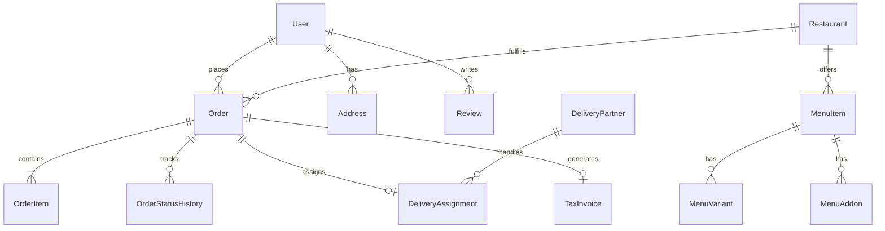

# Zestora Database Specification (`prisma/schema.prisma`)

This document outlines the database schema, models, relational architecture, and indexing strategies implemented in Zestora using Prisma and PostgreSQL.

---

## Architecture

The Zestora database schema is fully normalized and organized into the following core functional domains:

1. **Identity & Access Management (IAM)**:
   - `User`, `Account`, `Session`, `VerificationToken`
   - Role-Based Access Control supporting `CUSTOMER`, `RESTAURANT_OWNER`, `RESTAURANT_MANAGER`, `DELIVERY_PARTNER`, `GROCERY_MANAGER`, `ADMIN`, `SUPER_ADMIN`, and `SUPPORT_AGENT`.

2. **Restaurants & Menus**:
   - `Restaurant`, `RestaurantCategory`, `OperatingHour`, `BankDetail`
   - `MenuItem`, `MenuCategory`, `MenuVariant`, `MenuAddon`, `DietaryType`

3. **Quick-Commerce Grocery**:
   - `GroceryStore`, `ProductCategory`, `Product`, `Inventory`, `StockReservation`

4. **Order Management & Fulfillment**:
   - `Order`, `OrderItem`, `OrderStatusHistory`, `CancellationDetail`
   - Strict tracking of fulfillment phases from `PLACED` through `DELIVERED`.

5. **Logistics & Delivery Fleet**:
   - `DeliveryPartner`, `Vehicle`, `DeliveryAssignment`, `RiderLocationLog`
   - Dynamic tracking of duty status, vehicle capacity, and live GPS coordinates.

6. **Promotions, Pricing & Loyalty**:
   - `Coupon`, `CouponUsage`, `OfferBanner`, `SurgeConfig`
   - Support for flat discounts, percentage discounts, minimum cart criteria, and usage limits.

7. **Reviews & Customer Support**:
   - `Review`, `ReviewReply`, `SupportTicket`, `TicketMessage`

8. **Audit & Compliance**:
   - `AuditLog`: Immutable recording of mutations across all business entities.
   - `TaxInvoice`: Generated GST invoices with unique invoice numbering and breakdown.

---

## Key Relations Diagram



---

## Migration & Seeding Commands

```bash
# Generate Prisma Client
npx prisma generate

# Apply Migrations to PostgreSQL
npx prisma migrate dev --name init

# Seed Database
npm run db:seed
```
